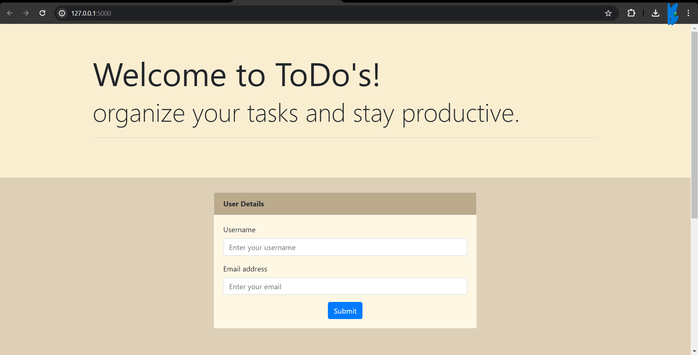
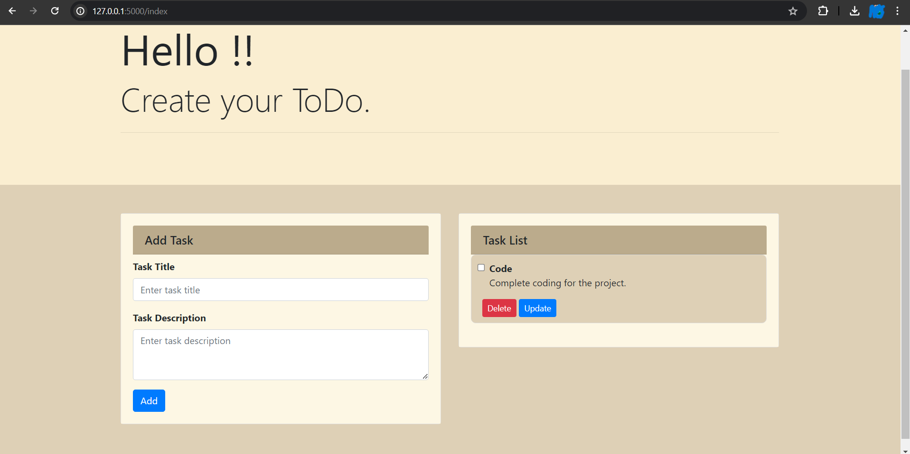

# Todo List Application 📝

## About ℹ️
This project is a simple web-based Todo List application. It allows users to manage their daily tasks with basic functionalities such as adding, updating, and deleting tasks.

## Description 📋
The Todo List app provides a straightforward interface for task management, making it ideal for personal use or as a demonstration of using various web technologies in a real-world application.

## Screenshots 🖼️

Add screenshots of your application here. You might include the home page, task addition, and task update views.

## Features ✨
- **Add Tasks**: Users can add tasks to their list with a description.
- **Update Tasks**: Users can modify existing tasks.
- **Delete Tasks**: Users can remove tasks they no longer need.

## Technologies 🛠️
- **Front-end**
  - **HTML/CSS**: Structures and styles the web pages.
  - **Bootstrap**: Provides responsive design and pre-styled components for faster development.
- **Back-end**
  - **Python/Flask**: Handles server-side logic, requests, and responses.
  - **SQLite**: Manages data persistence and storage for tasks.

## External Links 🔗
- [Live Demo](URL-to-live-demo)
- [Repository](URL-to-repository)

Feel free to visit the live demo or view the source code in this repository. Contributions, issues, and feature requests are welcome!

